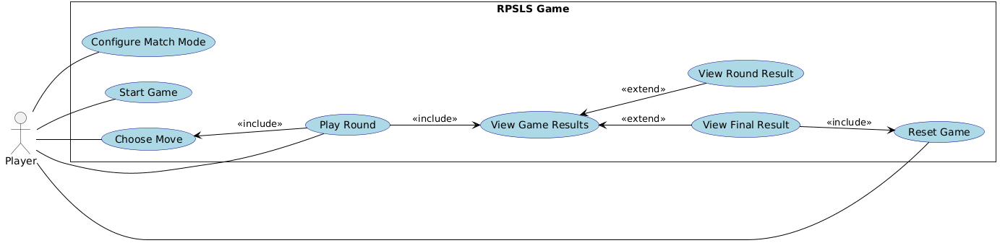
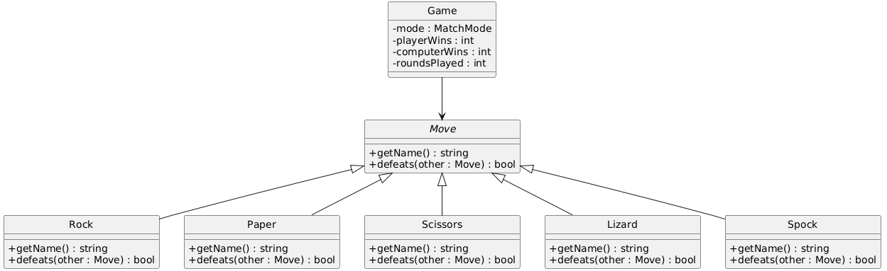

# Análise orientada a objeto

## Descrição Geral do domínio do problema

O jogo Rock, Paper, Scissors, Lizard, Spock é uma versão expandida de "Pedra, Papel e Tesoura", criada para reduzir empates e aumentar a variedade estratégica. O objetivo central é derrotar o oponente (computador) selecionando uma jogada/movimento conforme um conjunto fixo de regras.

### Regras Centrais

 Tesoura corta Papel e decapita Lagarto.  
 Papel cobre Pedra e refuta Spock.  
 Pedra esmaga Lagarto e amassa Tesoura.  
 Lagarto come Papel e envenena Spock.  
 Spock quebra Tesoura e vaporiza Pedra.  

### Modos de Jogo

 A aplicação possui duas opções de jogo:

  Partida Única: Uma rodada decisiva para uma experiência rápida.  
  Melhor de Três: Uma sequencia onde vence quem alcançar três vitórias primeiro, promovendo uma competição mais estratégica.

### Dinâmica da Partida

A interação é entre o Jogador (que faz sua escolha) e o Computador (que seleciona uma jogada aleatória). O resultado de cada rodada é determinado pela aplicação das regras, resultando em vitória do jogador, vitória do computador ou empate.

## Diagrama de Casos de Uso

    

### Detalhamento dos casos de uso

[UC01: Play Rock, Paper, Scissors, Lizard, Spock Game (All flow included)](uc01.md)

[UC02: Configure Match Mode (Configura Modo de Jogo)](uc02.md)

[UC03: Choose Move (Escolher Jogada/Movimento)](uc03.md)

[UC04: View Game Results (Visualizar Resultado)](uc04.md)

[UC05: Reset Game (Reiniciar Partida) - Opcional](uc05.md)
 
## Diagrama de Domínio do problema

    

[Retroceder](README.md) | [Avançar](uc01.md)
